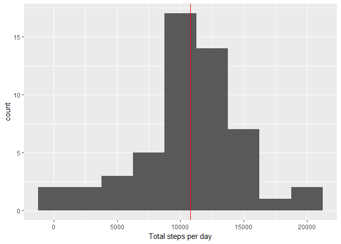
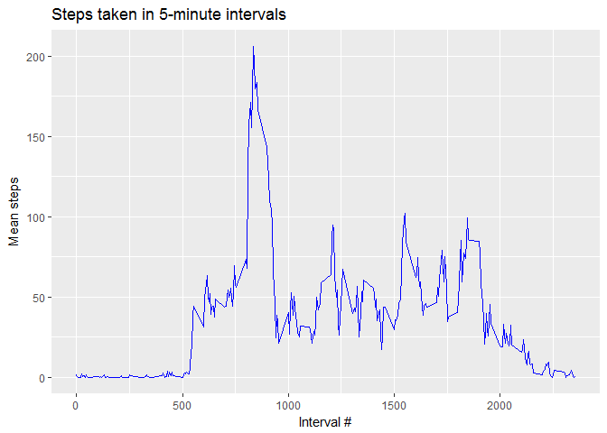
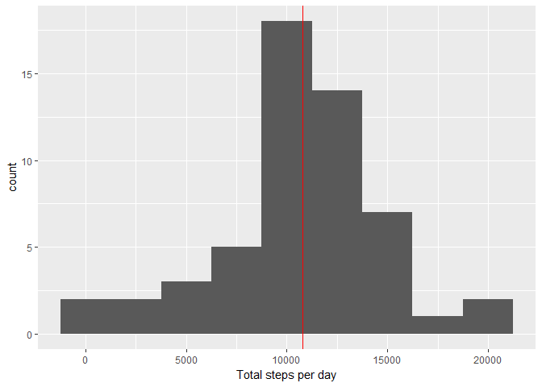
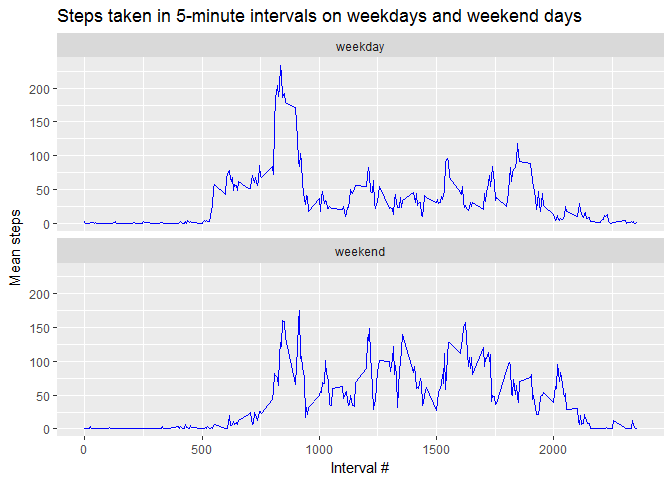

# Reproducible Research: Peer Assessment 1
Jason C. Myers  
January 24, 2017  


## Loading and preprocessing the data
Since the file is part of the repository, the .zip file is assumed to be present in the working directory. If it has not been unzipped, do so.

```r
if(!file.exists("activity.csv"))
  unzip("activity.zip")
```
Read the file into a variable called `stepData` and conver the date column into Date objects.

```r
stepData <- read.csv("activity.csv")
stepData$date <- as.Date(stepData$date, format="%Y-%m-%d")
```


## What is mean total number of steps taken per day?

```r
require(ggplot2)
```

```
## Loading required package: ggplot2
```

```r
stepsPerDay <- aggregate(steps ~ date, data=stepData, FUN=sum)
medSteps <- median(stepsPerDay$steps, na.rm= TRUE)
meanSteps <- mean(stepsPerDay$steps, na.rm = TRUE)
g <- ggplot(stepsPerDay, aes(steps)) + geom_histogram(binwidth = 2500)
g <- g + geom_vline(xintercept = medSteps, color = "red")
g <- g + labs(x = "Total steps per day")
print(g)
```

<!-- -->
  
  Report the median and mean values:

```r
print(paste("Median number of daily steps: ", medSteps))
```

```
## [1] "Median number of daily steps:  10765"
```

```r
print(paste("Mean number of daily steps: ", meanSteps))
```

```
## [1] "Mean number of daily steps:  10766.1886792453"
```

## What is the average daily activity pattern?
Plot the 5-minute intervals and average number of steps taken, averaged across all days  

```r
meanStepsPerInterval <- aggregate(steps ~ interval, data=stepData, FUN=mean)
g <- ggplot(meanStepsPerInterval, aes(interval, steps)) + geom_line(color = "blue")
g <- g + labs(x = "Interval #", y = "Mean steps", title = "Steps taken in 5-minute intervals")
print(g)
```

<!-- -->
  
Which interval has the maximum average steps?

```r
maxSteps <- with(meanStepsPerInterval, meanStepsPerInterval[steps == max(steps),])
print(paste("The maximum average number of steps (", maxSteps$steps, ") takes place in interval #", maxSteps$interval, sep=""))
```

```
## [1] "The maximum average number of steps (206.169811320755) takes place in interval #835"
```


## Imputing missing values
Count the missing values

```r
print(paste("There are",sum(is.na(stepData$steps)),"missing (NA) values."))
```

```
## [1] "There are 2304 missing (NA) values."
```
  
Replace missing values with the average for that 5-min interval across all days

```r
steps.imputed <- transform(stepData, steps=ifelse(is.na(steps), meanStepsPerInterval[meanStepsPerInterval$interval == interval, 2], steps))
```
  
  Replot steps/day histogram using imputed data and compare mean and median values

```r
stepsPerDay <- aggregate(steps ~ date, data=steps.imputed, FUN=sum)
medSteps <- median(stepsPerDay$steps, na.rm= TRUE)
meanSteps <- mean(stepsPerDay$steps, na.rm = TRUE)
g <- ggplot(stepsPerDay, aes(steps)) + geom_histogram(binwidth = 2500)
g <- g + geom_vline(xintercept = medSteps, color = "red")
g <- g + labs(x = "Total steps per day")
print(g)
```

<!-- -->

```r
print(paste("Median number of daily steps: ", medSteps))
```

```
## [1] "Median number of daily steps:  10765.5943396226"
```

```r
print(paste("Mean number of daily steps: ", meanSteps))
```

```
## [1] "Mean number of daily steps:  10766.1886792453"
```
  
  The impact of imputing the data appears to be a no change in the mean value, but a slight increase in the (now non-integer) median value.


## Are there differences in activity patterns between weekdays and weekends?
Create a factor `day` to indicate if a given day is a weekday or weekend

```r
steps.imputed$day <- factor(ifelse(weekdays(steps.imputed$date) == "Saturday" | weekdays(steps.imputed$date) == "Sunday", "weekend", "weekday"))
```

```r
meanStepsPerInterval <- aggregate(steps ~ interval + day, data=steps.imputed, FUN=mean)
g <- ggplot(meanStepsPerInterval, aes(interval, steps)) + geom_line(color = "blue")
g <- g + labs(x = "Interval #", y = "Mean steps", title = "Steps taken in 5-minute intervals on weekdays and weekend days")
g <- g + facet_wrap(~day, nrow = 2)
print(g)
```

<!-- -->
